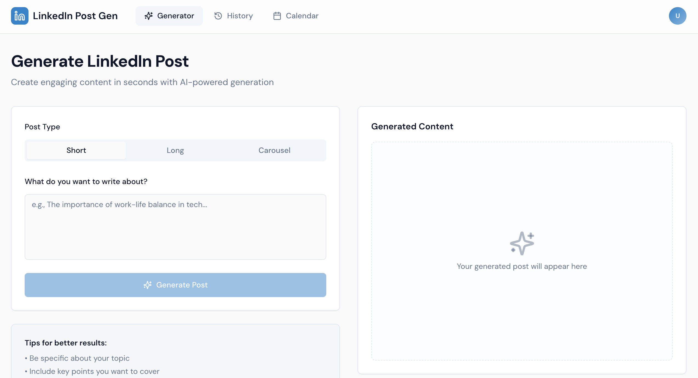
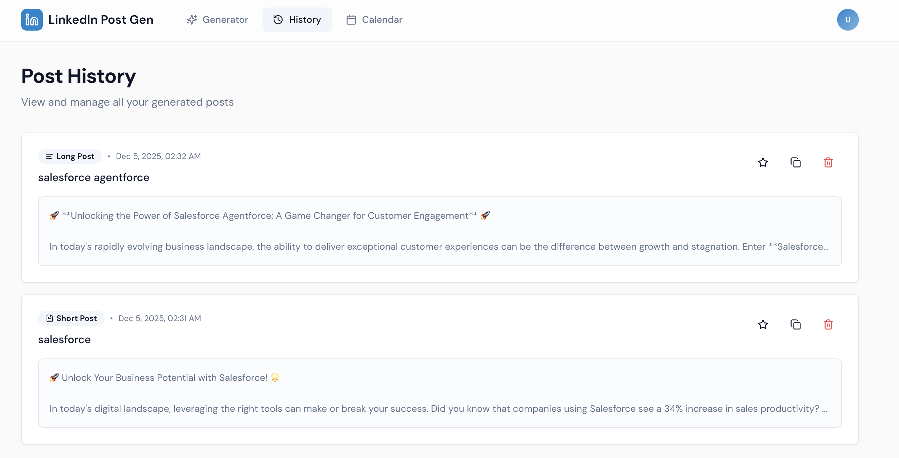
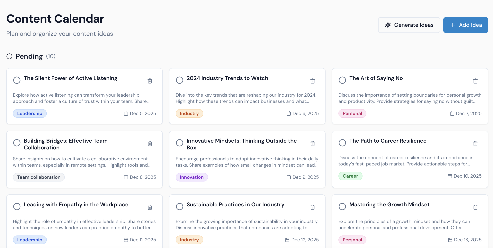

# LinkedIn Post Generator

A modern SaaS application built with Next.js and OpenAI for generating engaging LinkedIn content. Features a clean, professional design inspired by Linear, Notion, and Buffer.

## Features

### Post Generator
- Generate three types of LinkedIn posts:
  - **Short Posts**: Concise, impactful content (100-150 words)
  - **Long Posts**: In-depth thought leadership (300-500 words)
  - **Carousel Posts**: Multi-slide visual content (9 slides)
- AI-powered content generation using OpenAI GPT-4
- Theme-based post creation
- One-click copy and save functionality

### Post History
- View all generated posts
- Filter by post type
- Mark posts as favorites
- Quick copy and delete actions
- Beautiful card-based layout

### Content Calendar
- AI-generated content ideas
- Manual idea creation
- Schedule posts with dates
- Categorize by topic (Leadership, Career, Innovation, Industry, Personal)
- Track completion status
- Kanban-style organization

## Tech Stack

- **Framework**: Next.js 13 with App Router
- **Database**: Supabase (PostgreSQL)
- **AI**: OpenAI API (GPT-4o-mini)
- **Styling**: Tailwind CSS + shadcn/ui
- **Typography**: DM Sans font family
- **Icons**: Lucide React
- **Notifications**: Sonner

## Design System

### Colors
- Primary: LinkedIn Blue (#0A66C2)
- Background: Light gray (#F9FAFB)
- Clean, minimal palette with subtle accents

### Typography
- Font: DM Sans (400, 500, 600, 700)
- Modern, readable, professional

### UX Principles
- Fast and responsive
- Minimal loading states
- Smooth animations and micro-interactions
- Clean, uncluttered interface

## Screenshots

### Post Generator Dashboard

*Main dashboard where you can generate LinkedIn posts with AI assistance*

### Post History

*Browse, search, and manage all your generated posts in one place*

### Content Calendar

*Plan your content strategy with AI-generated ideas and scheduling*

## Getting Started

### Prerequisites
- Node.js 18+
- OpenAI API key
- Supabase account

### Environment Setup

1. Copy `.env.example` to `.env.local`:
```bash
cp .env.example .env.local
```

2. Fill in your environment variables:
```env
NEXT_PUBLIC_SUPABASE_URL=your_supabase_url
NEXT_PUBLIC_SUPABASE_ANON_KEY=your_supabase_anon_key
OPENAI_API_KEY=your_openai_api_key
```

### Installation

1. Install dependencies:
```bash
npm install
```

2. Run the development server:
```bash
npm run dev
```

## Database Schema

### Posts Table
- Stores all generated LinkedIn posts
- Tracks post type (short, long, carousel)
- Favorites functionality
- Timestamps for creation and updates

### Calendar Ideas Table
- Content idea management
- Scheduling with dates
- Status tracking (pending, completed, archived)
- Category organization

## API Routes

### `/api/generate`
Generates LinkedIn posts based on theme and type using OpenAI.

### `/api/generate-ideas`
Generates 10 content ideas with AI suggestions.

## Project Structure

```
├── app/
│   ├── (dashboard)/          # Main application pages
│   │   ├── page.tsx          # Post generator
│   │   ├── history/          # Post history
│   │   └── calendar/         # Content calendar
│   ├── api/                  # API routes
│   └── layout.tsx            # Root layout
├── components/
│   ├── ui/                   # shadcn/ui components
│   └── navigation.tsx        # Main navigation
├── lib/
│   ├── openai.ts            # OpenAI utilities
│   ├── supabase.ts          # Supabase client
│   └── utils.ts             # Helper functions
└── public/                   # Static assets
```

## Building for Production

```bash
npm run build
npm start
```

## Contributing

This is a V1 implementation. Future enhancements could include:
- User authentication
- Team collaboration
- Post scheduling
- Analytics and insights
- LinkedIn API integration for direct posting
- Template library
- Multi-language support

## License

MIT License — Copyright (c) 2025 M.A.G

This project is licensed under the MIT License. See the [LICENSE](./LICENSE) file for details.

You are free to use, modify, and distribute this project while maintaining proper attribution.
